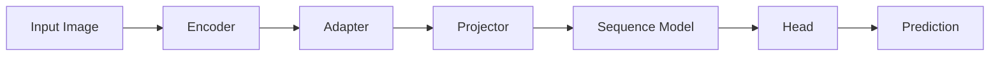

# Captcha OCR Documentation

This document provides a comprehensive guide to the `captcha_ocr` project, a modular deep learning framework for Optical Character Recognition (OCR) and classification tasks.

## 1. Architecture Overview

The framework is built on a modular pipeline architecture designed for flexibility and combinatorial experimentation.

### Pipeline Components

The data flows through the following stages:



1.  **Encoder**: Extracts visual features from the input image.
    *   Types: `convnext`, `resnet`.
2.  **Adapter**: Reshapes or processes encoder features to interface with the rest of the pipeline.
    *   `vertical_feature`: Groups the vertical dimension with 'f' horizontal pixels based on output size. i.e., [B, C, H, W] -> [B, W//f, C * H * f]. C * H * f is specified and f is internally computed. Throws error if (output_dim/C * H) is not an integer. Expects user to set width multiplier appropriately when variable width image processing is used, otherwise, W//f will throw an error. 1D sequence (for OCR).
    *   `flatten`: Flattens all spatial dimensions (for classification).
    *   `global_pool`: Global average/max pooling.
3.  **Projector**: Projects features to the correct `d_model` dimension.
    *   Types: `linear`, `mlp`, `bottleneck`, `residual`, `identity`.
4.  **Sequence Model**: Contextualizes the feature sequence (optional for classification).
    *   Types: `transformer_encoder` (standard), `transformer_decoder`, `rnn`, `bilstm`.
5.  **Head**: Produces final logits/predictions.
    *   `ctc`: Connectionist Temporal Classification (for variable-length OCR).
    *   `classification`: Standard cross-entropy classifier.
    *   `linear`, `mlp`: Simple projection heads.

---

## 2. Configuration System

The project uses a strictly typed, hierarchical configuration system based on Python dataclasses. This avoids "magic dictionaries" and ensures configuration validity.

### hierarchy

*   **`ExperimentConfig`** (Top-level)
    *   `dataset_config`: Data generation and processing.
    *   `model_config`: Architecture definition.
    *   `training_config`: Optimizer, scheduler, and training loop settings.

### Key Configurations

#### Experiment Config
| Key | Type | Description |
| :--- | :--- | :--- |
| `experiment_name` | `str` | Unique name for the run. |
| `seed` | `int` | Random seed. |
| `metadata_path` | `str` | Path to dataset metadata JSON. |
| `image_base_dir` | `str` | Base directory for images. |

#### Dataset Config
| Key | Type | Default | Description |
| :--- | :--- | :--- | :--- |
| `width` | `int` | `200` | Image width. |
| `height` | `int` | `80` | Image height. |
| `resize_mode` | `str` | `"variable"` | `"variable"` (pad) or `"fixed"` (stretch). |
| `word_transform` | `str` | `None` | e.g., `"random_capitalize"`. |
| `fonts` | `List[str]` | `None` | List of font paths (auto-selected if None). |

#### Model Config
| Key | Type | Default | Options |
| :--- | :--- | :--- | :--- |
| `task_type` | `str` | `"generation"` | `"generation"`, `"classification"`. |
| `pipeline_type` | `str` | `None` | `"standard_generation"`, `"standard_classification"`, `"sequence_classification"`. |
| `encoder_type` | `str` | `"convnext"` | `"resnet"`, etc. |
| `adapter_type` | `str` | `None` | `"vertical_collapse"`, `"flatten"`. |
| `sequence_model_type`| `str` | `"transformer_encoder"`| `"rnn"`, `"bilstm"`. |
| `head_type` | `str` | `"ctc"` | `"classification"`. |
| `d_model` | `int` | `256` | Latent dimension size. |
| `d_vocab` | `int` | `62` | Vocabulary size. |

---

## 3. CLI Reference

The project exposes a single entry point `cli.py` with multiple subcommands.

### `generate`
Generate synthetic captcha datasets.

```bash
python -m cli generate --config-file <PATH> [OPTIONS]
```
**Options:**
*   `--config-file` (Required): Path to dataset config YAML.
*   `--word-file`: Path to TSV file containing words (overrides config).
*   `--out-dir`: Directory to save generated images.
*   `--dataset-count`: Number of images to generate (randomly samples from word file).
*   `--font-root`: Directory containing fonts.

### `train`
Train a model.

```bash
python -m cli train --config-file <PATH> [OPTIONS]
```
**Options:**
*   `--config-file` (Required): Path to experiment config YAML.
*   `--wandb-project`: Name of WandB project for logging.
*   **Overrides**: `--epochs`, `--batch-size`, `--metadata-path`.

### `evaluate`
Evaluate a trained model on a validation set.

```bash
python -m cli evaluate --checkpoint <PATH> --metadata-path <JSON_PATH>
```

### `inference`
Run inference on images using a trained checkpoint.

```bash
python -m cli inference --checkpoint <PATH> --image-paths <PATH1> <PATH2> ...
```
**Options:**
*   `--checkpoint`: Path to `.pth` model file.
*   `--image-paths`: List of specific image files.
*   `--image-dir`: Directory of images to process (bulk inference).

---

## 4. Extending the Framework

### Adding a New Component
1.  **Define Config**: Add a new dataclass in `src/config/config.py` (e.g., `NewEncoderConfig`).
2.  **Implement Module**: Create the PyTorch module in `src/architecture/components/`.
3.  **Register**: Update `ModelConfig` logic in `src/config/config.py` to instantiate the new config.
4.  **Integrate**: Update the `Model` class (usually `src/architecture/model.py`) to initialize the component based on the config type string.
